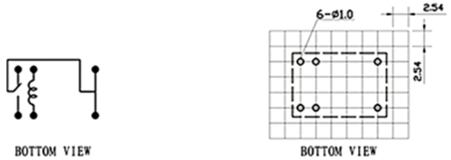
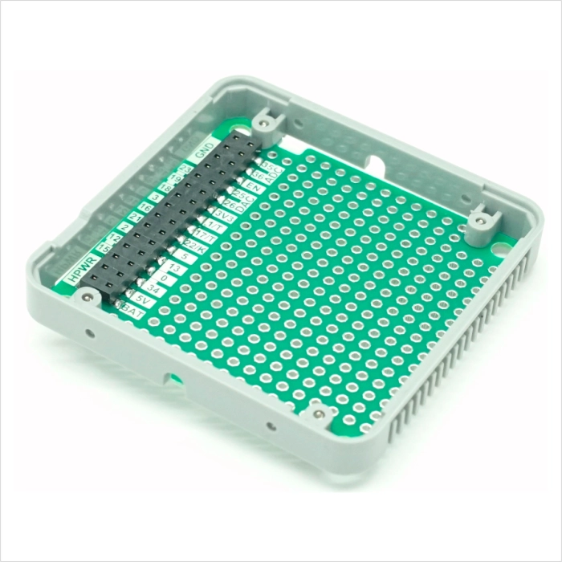
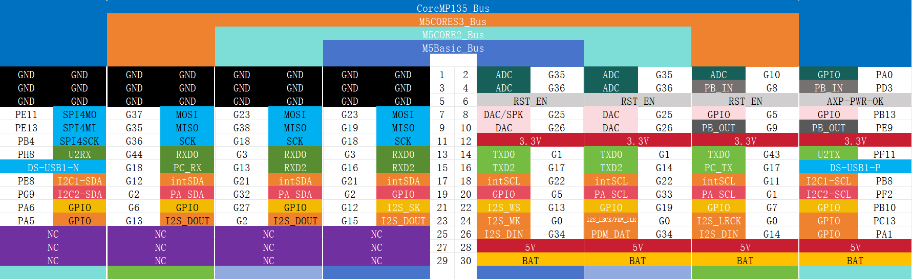
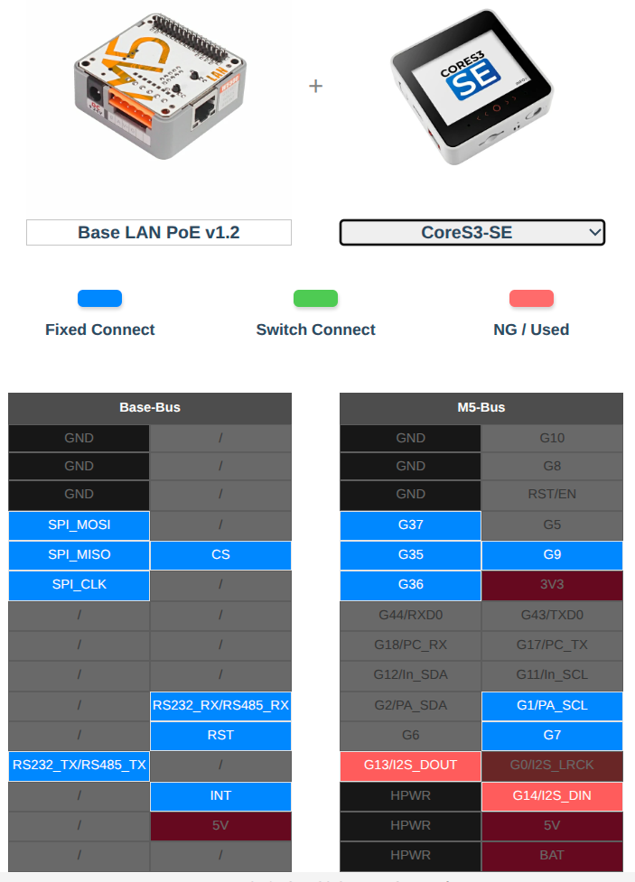

# ping4pow

## Motivation

Upon network recovery (from a power failure or an update to network infrastruture),
sensitive equipment may need to be rebooted after things have settled.
For many such, power to the device can be cycled to achieve this.
Without automation, this must be done manually.
It would be better with automation that could recognize such conditions and cycle power.

There are commercially available/configurable devices that address this issue.

* [WattBox](https://www.snapav.com/shop/en/snapav/wattbox)
* [Ping Watchdog](https://www.netio-products.com/en/glossary/watchdog-ping-ip-watchdog)

This is a better solution.

## Requirements

* Small, attractive package
* Display with touchscreen user interface
* Home Assistant integrable but not required for automation
* Wired (ethernet) access for reliable network monitoring
* Powered by [Power-over-Ethernet](https://en.wikipedia.org/wiki/Power_over_Ethernet) (PoE)
* Inserted in the low voltage power cord of sensitive equipment
* Galvanically isolated switching of equipment power
* Network health is determined by [ping](https://en.wikipedia.org/wiki/Ping_(networking_utility))ing multiple IP addresses
* Network failure is when all addresses can not be pinged over a period of time
* Network recovery is when all addresses can be pinged over a period of time
* Upon network recovery, power is turned off
* After a period of time, power is restored.

## Architecture

### Hardware

[M5Stack](https://docs.m5stack.com/en/start/intro/intro) products are used to provide a small and attractive hardware solution
that does not require a custom enclosure for switching low voltage loads.
Our stack needs a core with support from relay and PoE modules.

* [CoreS3-SE](https://docs.m5stack.com/en/core/M5CoreS3%20SE)
* [Module13.2 4Relay v1.1](https://docs.m5stack.com/en/module/4Relay%20Module%2013.2_V1.1)
* [Module Proto](https://docs.m5stack.com/en/module/proto)
* [Base LAN PoE v1.2](https://docs.m5stack.com/en/base/lan_poe_v12)

### Software

[ESPHome](https://esphome.io/) is used because of its ability to support our chosen hardware and the potential for other choices.
It can be configured in a high level language (YAML) and will only do what you tell it to do.
A configured device can perform all the automations without any external support.
Optionally, such a device can be used by Home Assistant.

## Deployment

### Hardware

The stack will be assembled in the order described above.

#### Module13.2 4Relay v1.1

Only the first relay in the module will be used.
It will be configured to provide module input power to relay output power in a Normally Closed (NC) fashion.
We want the relay to operate in a NC fashion so that when power is removed from the stack the relay will be closed
(power to the controlled device will be on).

Remove module input power jumpers to galvanically isolate these pins from the M5-Bus (stack) HPWR and system GND.
Add a jumper such that the module input power pin 1 is connected to the relay output power pin 1.
Add a jumper such that the module input power pin 2 is connected to the relay common pin.

The relay is hard-wired on the module in a Normally Open (NO) fashion.
That is, the relay output power pin 2 is connected by PCB trace to the NO pin on the relay.
Cut this trace and add a bodge wire to connect the relay ouput power pin 2 with the NC pin on the relay.

Wire module input power pins to an adapter pigtail that accepts the plug of the power adapter of the controlled device.
Wire relay power output pins to an adapter pigtail that provides the power plug expected by the controlled device.
Use pins 1 for the always-connected wire and pins 2 for the relay-switched wire.

#### Module Proto

This module is inserted in the stack to resolve a collision,
between the ethernet and display components,
on the CoreS3's GPIO35 pin.
For the ethernet component, GPIO35 is accessed over the M5-Bus.
With this module, GPIO6 can be routed to this component instead.

Note that the labeling of the pins on the proto board reflect M5Basic_Bus variant of the M5-Bus.

We are concerned with the M5CORES3_Bus variant.
Identify the pins by their location.

On the proto board,
sever the male pin connecting SPI_MISO to G35 on the M5-Bus pin header.
Bridge between the SPI_MISO socket and G6 pin with a bodge wire.

Alternately, this bodge could be done directly on the Base LAN PoE board
at the risk of damaging a much more expensive board
versus the benefit of a smaller stack.

#### Base LAN PoE v1.2

Power, and supply network access, over the RJ45 ethernet port.

### Software

These instructions are written for a Fedora Linux platform.
Similar steps may be taken for other Linux, MacOS or Windows platforms.

Get the source from this repository by the appropriate method:

    git clone https://github.com/rtyle/ping4pow.git
    git clone git@github.com:rtyle/ping4pow.git

All commands documented here are executed from this directory.

    cd ping4pow

Update all submodules of this repository.

    git submodule update --init --recursive

Install python

    sudo dnf install python

Create a python virtual environment for this project.

    python -m venv .venv

Activate the virtual environment every time you want to use ESPHome within this project.

    source .venv/bin/activate

With your virtual environment activated, install ESPHome using pip:

    pip install esphome

To copy or reinstall M5Stack demo firmware, download and extract M5Burner

    https://m5burner-cdn.m5stack.com/app/M5Burner-v3-beta-linux-x64.zip

Build, install and run firmware

    esphome run config/ping4pow.yaml

