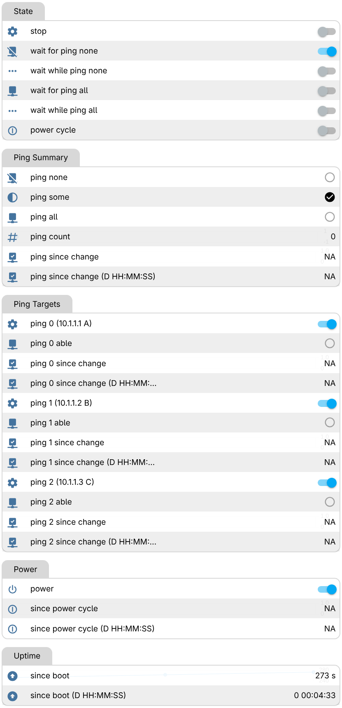
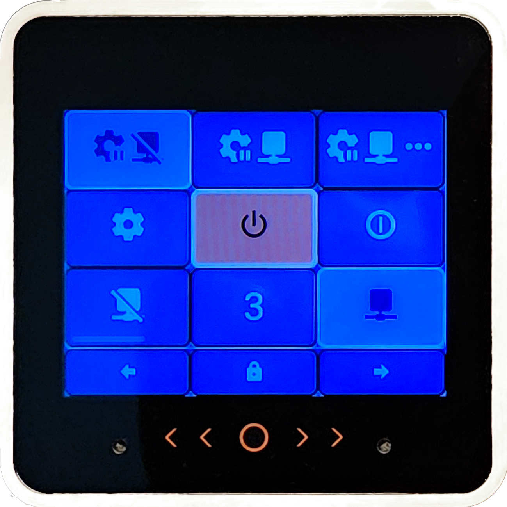

# ping4pow

## Motivation

Upon network recovery,
sensitive equipment may need to be rebooted after things have settled.
For many such, power to the device can be cycled to achieve this.
Without automation, this must be done manually.
It would be better with automation that could recognize such conditions and cycle power.

There are commercially available/configurable devices that address this issue.

* [WattBox](https://www.snapav.com/shop/en/snapav/wattbox)
* [Ping Watchdog](https://www.netio-products.com/en/glossary/watchdog-ping-ip-watchdog)

This is a better solution.

Ping4pow can only switch loads that can be safely handled by its relay.
Relay solutions that are embedded in its small footprint will only be able to switch low voltage loads.
However, an external relay solution (like an [iot-power-relay](https://dlidirect.com/products/iot-power-relay))
can be controlled by a GPIO pin for more demanding loads.

## Features

* Small, attractive package
* Display with touchscreen user interface
* Display can be turned off
* User interface can be locked
* Home Assistant integrable but not required for automation
* Wired (ethernet) access for reliable network monitoring
* Powered by [Power-over-Ethernet](https://en.wikipedia.org/wiki/Power_over_Ethernet) (PoE)
* Flexible relay solutions for handling loads
* Galvanically isolated switching of equipment power
* Network health is determined by [ping](https://en.wikipedia.org/wiki/Ping_(networking_utility))ing multiple IP addresses
* Network failure is when all addresses can not be pinged for a while.
* Network recovery is when all addresses can be pinged for a while.
* Upon network recovery, power is cycled.

## Architecture

### Hardware

[M5Stack](https://docs.m5stack.com/en/start/intro/intro) products are used to provide a small and attractive hardware solution
that does not require a custom enclosure for switching low voltage loads.
Our stack needs a core with support from a base LAN PoE module.

* [CoreS3-SE](https://docs.m5stack.com/en/core/M5CoreS3%20SE)
* [Base LAN PoE v1.2](https://docs.m5stack.com/en/base/lan_poe_v12)

To support both the core display and the ethernet LAN at the same time, a custom M5-Bus adapter must be used to resolve GPIO pin conflicts. This might be done using an M5Bus wire-bodged Module Proto. Alternately, the PCB of the Module Proto might be swapped out with one that has the bodge baked in (see [adapter](kicad/projects/adapter)).

* [Module Proto](https://docs.m5stack.com/en/module/proto)

To switch the load we will need a relay. M5Stack provides a 4Relay Module. Alternately, the M5-Bus adapter might be expanded to provide a relay using the frame of an M5Stack Module13.2 Proto (see [adapter_relay](kicad/projects/adapter_relay)).

* [Module13.2 4Relay v1.1](https://docs.m5stack.com/en/module/4Relay%20Module%2013.2_V1.1)
* [Module13.2 Proto](https://docs.m5stack.com/en/module/proto13.2)

A Module13.2 Proto might also be used to bodge-wire the M5-Bus adapter and provide external access to the same GPIO pin used by the adapter_relay.
This could be used to drive an external relay for more demanding loads.

### Software

[ESPHome](https://esphome.io/) is used because of its ability to support our chosen hardware and the potential for other choices.
It can be configured in a high level language (YAML) and will only do what you tell it to do.
A configured device can perform all the automations without any external support.
Optionally, such a device can be used by Home Assistant.

## Deployment

### Hardware

The stack should be assembled with the core on top, followed by the relay solution, the adapter solution and finally the PoE base.

#### Module13.2 Proto adapter_relay

This solution uses a Module13.2 Proto frame with the PCB replaced with one built from the [adapter_relay](kicad/projects/adapter_relay) kicad project. There is no need for a separate M5-Bus adapter.

The adapter_relay uses a double-pole double-throw (DPDT) [signal relay](https://na.industrial.panasonic.com/products/relays-contactors/mechanical-signal-relays/lineup/signal-relays/series/119572/model/119942) to switch both conductors of the galvanically isolated DC load. Jumpers must be installed in the normally-closed (NC) positions. The load is passed through the board using standard 5.5mm x 2.1mm DC barrel connections. Openings in the frame of the Module13.2 Proto must be expanded to accomodate the DC jacks. It doesn't matter which jack is used for which plug.

#### Module13.2 4Relay v1.1 and Module Proto adapter

This solution uses the Module13.2 4Relay v1.1 and a separate M5-Bus Module Proto based adapter. The adapter can be built from the [adapter](kicad/projects/adapter) kicad project or hand made using its schematic for a reference. If hand made, the disconnected male pins should be clipped and the re-routing of signals made using bodge wires.

<picture>
    <source media="(prefers-color-scheme: dark)" srcset="docs/adapter.schematic.dark.png">
    <source media="(prefers-color-scheme: light)" srcset="docs/adapter.schematic.light.png">
    
</picture>

Only the first [signal relay](https://www.amazon.com/gp/product/B0CWCTHCFT) in the module will be used.
It will be configured to provide module input power to relay output power in a Normally Closed (NC) fashion.
We want the relay to operate in a NC fashion so that when power is removed from the stack the relay will be closed
(power to the controlled device will be on).

Module input power must be galvanically isolated from the M5-Bus (stack) HPWR and system GND.
**Remove** the jumpers that connect these.

<picture>
    <source media="(prefers-color-scheme: dark)" srcset="docs/relay.hpwr.dark.png">
    <source media="(prefers-color-scheme: light)" srcset="docs/relay.hpwr.light.png">
    
</picture>

Set the relay jumpers in the "load" configuration.

<picture>
    <source media="(prefers-color-scheme: dark)" srcset="docs/relay.load.dark.png">
    <source media="(prefers-color-scheme: light)" srcset="docs/relay.load.light.png">
    
</picture>

The relay is hard-wired on the module in a Normally Open (NO) fashion.
That is, the relay output power is connected by PCB trace to the NO pin on the relay.
Cut this trace and add a bodge wire to connect the relay ouput power with the NC pin on the relay.

Wire module input power pins to an adapter pigtail that accepts the plug of the power adapter of the controlled device.
Alternately, cut the plug off the power adapter and wire the adapter directly to the 4relay input power plug.
Wire relay power output pins to an adapter pigtail that provides the power plug expected by the controlled device.
Alternately, cut the plug off the power adapter and wire the plug directly to the 4relay output power plug.

#### Base LAN PoE v1.2

Stack an M5-Bus adapter on top using one of the methods described above.
Power, and supply network access, over the RJ45 ethernet port.

### Software

These instructions are written for a Fedora Linux platform.
Similar steps may be taken for other Linux, MacOS or Windows platforms.

Get the source from this repository by the appropriate method:

    git clone https://github.com/rtyle/ping4pow.git
    git clone git@github.com:rtyle/ping4pow.git

All commands documented here are executed from this directory.

    cd ping4pow

Install python

    sudo dnf install python

Create a python virtual environment for this project.

    python -m venv .venv

Activate the virtual environment every time you want to use ESPHome within this project.

    source .venv/bin/activate

With your virtual environment activated, install ESPHome using pip:

    pip install esphome

Configure the order, address and name of each host to be ping-monitored.
Each is specifed by an address, name pair in an m4 host macro invocation.

    cp config/hosts{.example,}.m4; vi config/hosts.m4

Choose an ESPHome configuration for
M5Stack Module13.2 4Relay hardware (default) or a GPIO relay.

    m4 config/ping4pow.m4 > config/ping4pow.yaml
    m4 -Dgpio_relay config/ping4pow.m4 > config/ping4pow.yaml

Connect a USB cable between your computer and the M5Stack CoreS3
and flash its firmware with this ESPHome configuration. 

    esphome run config/ping4pow.yaml

Connect by ethernet to a power-over-ethernet capable port and unplug the USB cable.
Connect the switched load to the relay.

## Usage

Each ping target defined (by address & name) and ordered (#) in the `hosts.m4` file will be periodically pinged.
Each will be represented by a

* `ping # (address name)` switch (where # is its order) to enable/disable pinging and summary consideration of the target.
* `ping # able` binary sensor that reflects the pingability of the target.
* `ping # since` sensor that reflects the time elapsed since the last change in pingability.

These target ping sensors will be summarized by a

* `ping none` binary sensor that is true unless an enabled target is pingable.
* `ping all` binary sensor that is true unless an enabled target is not pingable.
* `ping some` binary sensor that is true if "ping none" and "ping all" are false.
* `ping count` sensor that reflects the number of enabled and pingable targets.
* `ping since` sensor that reflects the time elapsed since the last change in target pingability.

The automation provided by ping4pow is implemented as a state machine.
These states are reflected in the user interface as switches.
Only one state/switch can be active/on at a time.
States can be entered through a switch action in the user interface.
These states/switches are:

0. `Stop`. When on, the state machine is stopped. Turn off to advance to state 1.
1. Wait for `ping none`. Then advance to state 2.
2. Wait while `ping none`. Then advance to state 3; otherwise, retreat to state 1.
3. Wait for `ping all`. Then advance to state 4.
4. Wait while `ping all`. Then advance to state 5; otherwise, retreat to state 3.
5. `Power cycle`. Turn power off, pause, turn power on and then start over in state 1.

In addition, ping4pow exposes

* A `power` switch that reflects/controls power to the connected load.
* A `since boot` sensor that reflects the time elapsed since booting the ping4pow device.
* A `since power cycle` sensor that reflects the time elapsed since the power to the load was automatically affected.

All since sensors are in units of seconds.

A web-based user interface at http://ping4pow.local exposes these switches and sensors.

<picture>
    <source media="(prefers-color-scheme: dark)" srcset="docs/ping4pow.web.dark.png">
    <source media="(prefers-color-scheme: light)" srcset="docs/ping4pow.web.light.png">
    
</picture>

These are also presented locally on the ping4pow device's display.

Under the display is are soft buttons on the bezel

* <picture>
        <source media="(prefers-color-scheme: dark)" srcset="docs/mdi/chevron-double-left.dark.svg">
        <source media="(prefers-color-scheme: light)" srcset="docs/mdi/chevron-double-left.light.svg">
        
    </picture> Decrease display brightness
* <picture>
        <source media="(prefers-color-scheme: dark)" srcset="docs/mdi/circle-outline.dark.svg">
        <source media="(prefers-color-scheme: light)" srcset="docs/mdi/circle-outline.light.svg">
        
    </picture> Navigate home to state tile
* <picture>
        <source media="(prefers-color-scheme: dark)" srcset="docs/mdi/chevron-double-right.dark.svg">
        <source media="(prefers-color-scheme: light)" srcset="docs/mdi/chevron-double-right.light.svg">
        
    </picture> Increase display brightness

At the bottom of the display is a user interface lock and tile navigation buttons

* <picture>
        <source media="(prefers-color-scheme: dark)" srcset="docs/mdi/arrow-left-bold.dark.svg">
        <source media="(prefers-color-scheme: light)" srcset="docs/mdi/arrow-left-bold.light.svg">
        
    </picture> Previous tile in rotation
* <picture>
        <source media="(prefers-color-scheme: dark)" srcset="docs/mdi/lock.dark.svg">
        <source media="(prefers-color-scheme: light)" srcset="docs/mdi/lock.light.svg">
        
    </picture> User input is locked (<picture>
        <source media="(prefers-color-scheme: dark)" srcset="docs/mdi/lock-open.dark.svg">
        <source media="(prefers-color-scheme: light)" srcset="docs/mdi/lock-open.light.svg">
        
    </picture> when not)
* <picture>
        <source media="(prefers-color-scheme: dark)" srcset="docs/mdi/arrow-right-bold.dark.svg">
        <source media="(prefers-color-scheme: light)" srcset="docs/mdi/arrow-right-bold.light.svg">
        
    </picture> Next tile in rotation

The rest of the display is used for the current tile.
Using the next and previous tile controls, one can rotate through them.
The tiles are:

* State tile
* Since tile
* Target tile (one for each)

### State Tile

The top row of buttons reflect states 1, 2, 3 and 4.

* <picture>
        <source media="(prefers-color-scheme: dark)" srcset="docs/mdi/cog-pause.dark.svg">
        <source media="(prefers-color-scheme: light)" srcset="docs/mdi/cog-pause.light.svg">
        <picture>
        <source media="(prefers-color-scheme: dark)" srcset="docs/mdi/network-off.dark.svg">
        <source media="(prefers-color-scheme: light)" srcset="docs/mdi/network-off.light.svg">
        
        </picture>
    </picture> Wait for <code>ping none</code>
* <picture>
        <source media="(prefers-color-scheme: dark)" srcset="docs/mdi/cog-pause.dark.svg">
        <source media="(prefers-color-scheme: light)" srcset="docs/mdi/cog-pause.light.svg">
        <picture>
        <source media="(prefers-color-scheme: dark)" srcset="docs/mdi/network-off.dark.svg">
        <source media="(prefers-color-scheme: light)" srcset="docs/mdi/network-off.light.svg">
        <picture>
        <source media="(prefers-color-scheme: dark)" srcset="docs/mdi/dots-horizontal.dark.svg">
        <source media="(prefers-color-scheme: light)" srcset="docs/mdi/dots-horizontal.light.svg">
        
    </picture> Wait while <code>ping none</code>
* <picture>
        <source media="(prefers-color-scheme: dark)" srcset="docs/mdi/cog-pause.dark.svg">
        <source media="(prefers-color-scheme: light)" srcset="docs/mdi/cog-pause.light.svg">
        <picture>
        <source media="(prefers-color-scheme: dark)" srcset="docs/mdi/network.dark.svg">
        <source media="(prefers-color-scheme: light)" srcset="docs/mdi/network.light.svg">
        
    </picture> Wait for <code>ping all</code>
* <picture>
        <source media="(prefers-color-scheme: dark)" srcset="docs/mdi/cog-pause.dark.svg">
        <source media="(prefers-color-scheme: light)" srcset="docs/mdi/cog-pause.light.svg">
        <picture>
        <source media="(prefers-color-scheme: dark)" srcset="docs/mdi/network.dark.svg">
        <source media="(prefers-color-scheme: light)" srcset="docs/mdi/network.light.svg">
        <picture>
        <source media="(prefers-color-scheme: dark)" srcset="docs/mdi/dots-horizontal.dark.svg">
        <source media="(prefers-color-scheme: light)" srcset="docs/mdi/dots-horizontal.light.svg">
        
    </picture> Wait while <code>ping all</code>

The middle row of buttons reflect state 0, `power` and state 4

* <picture>
        <source media="(prefers-color-scheme: dark)" srcset="docs/mdi/cog.dark.svg">
        <source media="(prefers-color-scheme: light)" srcset="docs/mdi/cog.light.svg">
        
    </picture> <code>Stop</code> (<picture>
        <source media="(prefers-color-scheme: dark)" srcset="docs/mdi/cog-stop.dark.svg">
        <source media="(prefers-color-scheme: light)" srcset="docs/mdi/cog-stop.light.svg">
        
    </picture> when stopped)
* <picture>
        <source media="(prefers-color-scheme: dark)" srcset="docs/mdi/power.dark.svg">
        <source media="(prefers-color-scheme: light)" srcset="docs/mdi/power.light.svg">
        
    </picture> <code>power</code>
* <picture>
        <source media="(prefers-color-scheme: dark)" srcset="docs/mdi/power-cycle.dark.svg">
        <source media="(prefers-color-scheme: light)" srcset="docs/mdi/power-cycle.light.svg">
        
    </picture> <code>Power cycle</code>

The bottom row reflects the summary ping sensors.
At most, one of these will be on.
The label on the widget reflecting state of the `ping some` binary sensor will reflect the `ping count` sensor value regardless.

* <picture>
        <source media="(prefers-color-scheme: dark)" srcset="docs/mdi/network-off.dark.svg">
        <source media="(prefers-color-scheme: light)" srcset="docs/mdi/network-off.light.svg">
        
    </picture> <code>ping none</code>
* <picture>
        <source media="(prefers-color-scheme: dark)" srcset="docs/mdi/pound.dark.svg">
        <source media="(prefers-color-scheme: light)" srcset="docs/mdi/pound.light.svg">
        
    </picture> <code>ping some</code> with <code>ping count</code> (#)
* <picture>
        <source media="(prefers-color-scheme: dark)" srcset="docs/mdi/network.dark.svg">
        <source media="(prefers-color-scheme: light)" srcset="docs/mdi/network.light.svg">
        
    </picture> <code>ping all</code>

### Since Tile

The three rows of this tile reflect times since an event.
This time is formatted as either "N/A" (if there was never such an event) or the number of days, hours, minutes and seconds (D HH:MM:SS) since the event.

* <picture>
        <source media="(prefers-color-scheme: dark)" srcset="docs/mdi/check-network.dark.svg">
        <source media="(prefers-color-scheme: light)" srcset="docs/mdi/check-network.light.svg">
        
    </picture> <code>ping since</code>
* <picture>
        <source media="(prefers-color-scheme: dark)" srcset="docs/mdi/power-cycle.dark.svg">
        <source media="(prefers-color-scheme: light)" srcset="docs/mdi/power-cycle.light.svg">
        
    </picture> <code>since power cycle</code>
* <picture>
        <source media="(prefers-color-scheme: dark)" srcset="docs/mdi/arrow-up-bold-circle.dark.svg">
        <source media="(prefers-color-scheme: light)" srcset="docs/mdi/arrow-up-bold-circle.light.svg">
        
    </picture> <code>since boot</code>

### Target Tile

There is a target tile for each ping target in `hosts.m4`.

The first row of this tile reflects whether the target is enabled and its pingability.

* <picture>
        <source media="(prefers-color-scheme: dark)" srcset="docs/mdi/cog.dark.svg">
        <source media="(prefers-color-scheme: light)" srcset="docs/mdi/cog.light.svg">
        
    </picture> <code>ping # (address name)</code> enabled (<picture>
        <source media="(prefers-color-scheme: dark)" srcset="docs/mdi/cog-stop.dark.svg">
        <source media="(prefers-color-scheme: light)" srcset="docs/mdi/cog-stop.light.svg">
        
    </picture> when not)
* <picture>
        <source media="(prefers-color-scheme: dark)" srcset="docs/mdi/network.dark.svg">
        <source media="(prefers-color-scheme: light)" srcset="docs/mdi/network.light.svg">
         <code>ping # able</code> (<picture>
        <source media="(prefers-color-scheme: dark)" srcset="docs/mdi/network-off.dark.svg">
        <source media="(prefers-color-scheme: light)" srcset="docs/mdi/network-off.light.svg">
        
        </picture> when not)
    </picture>

The next two rows are for `ping # since` and for identifying the target by address and name.

* <picture>
        <source media="(prefers-color-scheme: dark)" srcset="docs/mdi/check-network.dark.svg">
        <source media="(prefers-color-scheme: light)" srcset="docs/mdi/check-network.light.svg">
        
    </picture> <code>ping # since</code>
* <picture>
        <source media="(prefers-color-scheme: dark)" srcset="docs/mdi/tag.dark.svg">
        <source media="(prefers-color-scheme: light)" srcset="docs/mdi/tag.light.svg">
         <code>address</code> <code>name</code>
    </picture>
