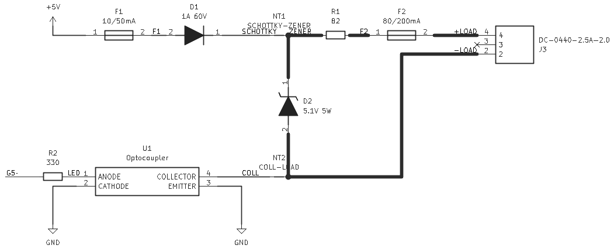

# GPIO Relay Protection Circuit - Design Documentation

## Overview

This protection circuit provides robust, fail-safe control of an external [DLI IoT Power Relay](https://dlidirect.com/products/iot-power-relay) from an ESP32-based ping4pow device powered by PoE. The circuit is specifically designed to protect the ping4pow hardware from operator errors, including accidental dead shorts and incorrect DC power supply connections (up to 48V).

## Design Philosophy

The circuit follows a **defense-in-depth** strategy with multiple layers of protection:
1. **Galvanic isolation** - Complete electrical isolation between GPIO and external connections
2. **Current limiting** - Series resistance limits fault currents to safe levels
3. **Overvoltage clamping** - Zener diode clamps excessive voltages
4. **Overcurrent protection** - Dual polyfuses interrupt fault conditions
5. **Backfeed prevention** - Schottky diode blocks reverse current flow

Each protection mechanism is **independently validated** to ensure the circuit survives even if one protection layer fails.

## Circuit Architecture

### Schematic Overview

<picture>
    <source media="(prefers-color-scheme: dark)" srcset="README/schematic.dark.png">
    <source media="(prefers-color-scheme: light)" srcset="README/schematic.light.png">
    
</picture>

### Signal Flow

**Normal Operation (GPIO HIGH):**
1. 5V from PoE supply passes through input polyfuse F1
2. Schottky diode D1 drops ~0.25V (at 1mA), preventing backfeed to 5V rail
3. Series resistor R1 (82Ω) limits current
4. Output polyfuse F2 provides additional overcurrent protection
5. Voltage arrives at DC Jack (+) at ~4.67V
6. GPIO HIGH drives optocoupler U1 LED with 10mA
7. U1 phototransistor conducts, connecting DC Jack (-) to GND
8. Relay circuit completes: DC Jack (+) → Relay → DC Jack (-) → U1 → GND
9. Relay receives ~0.95mA at ~4.67V and activates

**Zener D2 monitoring:**
- Connected across DC Jack (+) and DC Jack (-)
- During normal operation: 4.75V < 5.1V threshold, Zener not conducting
- During fault: Clamps voltage between DC Jack (+) and DC Jack (-) to ~5.6V

## Component Selection and Justification

### F1 - Input Polyfuse (Littelfuse 0603L001/60YR)
**Specification:** 10mA hold / 50mA trip, 60V, 0603 package

**Purpose:** Protects the 5V PoE supply rail from overcurrent faults, particularly dead shorts at the DC jack output.

**Selection Rationale:**
- **Hold current (10mA):** Normal relay current is ~0.95mA, giving 10.5x safety margin
- **Trip current (50mA):** Dead short produces 58mA, exceeding trip threshold by 16%
- **Trip time at 58mA:** Approximately 5-30 seconds
- **Component stress during trip:** R1 dissipates 0.28W (56% of 0.5W rating), all components safe
- **60V rating:** Exceeds maximum expected voltage (48V) with 25% margin
- **Availability:** Minimum trip current available from Littelfuse in required voltage rating

**Why this trip point:** This was the lowest trip current available in 0603 SMD package with adequate voltage rating. The 50mA trip provides reliable protection for dead shorts (58mA) while not tripping during normal operation (0.95mA).

### F2 - Output Polyfuse (Littelfuse 0603L008YR)
**Specification:** 80mA hold / 200mA trip, 60V, 0603 package

**Purpose:** Protects R1 and D2 from excessive current when external overvoltage sources (wall adapters) are connected to the DC jack.

**Selection Rationale:**
- **Hold current (80mA):** Provides 84x margin over normal relay current
- **Trip current (200mA):** At 48V fault, current reaches 517mA (2.6x trip threshold), causing F2 to trip within 1-2 seconds
- **Why this matters:** Limits duration that D2 must dissipate 2.9W and R1 must handle 22W pulse
- **Placement:** On output side (after R1) to specifically protect against external fault sources

### D1 - Schottky Diode (OnSemi SS16T3G)
**Specification:** 60V, 1A, Vf ~0.25V @ 1mA, SMA package

**Purpose:** Prevents reverse current (backfeed) into the 5V PoE supply when external voltages are applied to DC jack.

**Selection Rationale:**
- **60V rating:** Handles worst-case differential (48V input minus 5.6V Zener clamp = 42.4V) with 43% margin
- **Schottky advantage:** Forward voltage only 0.25V at 1mA vs 0.7V for standard diode
  - Maximizes voltage to relay: 4.67V with Schottky vs 4.25V with standard diode
  - Lower voltage drop critical for relay operation at minimum current
- **Measured Vf:** At 0.95mA operating current, Vf ≈ 0.25V (verified empirically)
  - Much lower than 0.4-0.5V specified at higher currents (100mA+)
  - Datasheet curves don't extend below 100mA, actual measurement essential

**Backfeed protection:** When external voltage >5.25V appears at DC jack, D1 becomes reverse-biased and blocks current from reaching 5V rail, protecting all PoE-powered devices.

### D2 - Zener Diode (MCC SMBJ5338B-TP)
**Specification:** 5.1V nominal, 5W continuous, SMB package

**Purpose:** Clamps voltage across DC jack output (between + and -), protecting the relay and providing current path to trip F2 during overvoltage faults.

**Selection Rationale:**
- **5.1V nominal voltage:** 
  - Normal operation: 4.75V < 5.1V threshold, Zener doesn't conduct
  - Under load: Clamps at ~5.6V
  - Chosen as closest available voltage to operating point (4.75V) while maintaining margin
- **Why not 5.0V:** Not available in 5W SMB package from major distributors
- **Why not 6.2V:** Would clamp at ~6.8V, allowing higher voltage to reach relay and increasing Zener power dissipation (3.2W vs 2.9W at 48V fault)
- **5W power rating critical for 48V fault:**
  - Power dissipation: 5.6V × 517mA = 2.9W
  - Utilization: 58% of 5W rating (42% safety margin)
  - Duration: 1-2 seconds until F2 trips
- **Thermal management:** SMB package with ≥100mm² copper pour per pin (top + bottom layers, thermal vias) provides adequate heat dissipation

**Connection:** Zener is connected directly across DC jack output (cathode to DC+, anode to DC-), NOT between DC+ and GND. This allows it to clamp voltage regardless of optocoupler state.

### R1 - Series Resistor (Panasonic ERJ-P14F82R0U)
**Specification:** 82Ω, 0.5W, 1% tolerance, 1210 package

**Purpose:** Primary current-limiting element protecting against faults. Limits current during shorts and overvoltage conditions.

**Selection Rationale - Balancing Three Requirements:**

**1. Normal Operation:**
- Voltage drop: 0.95mA × 82Ω = 78mV
- Relay receives: 4.75V - 0.078V = 4.67V ✓
- Minimal impact on relay voltage

**2. Dead Short Protection:**
- Current: 4.75V / 82Ω = 58mA
- Exceeds F1 trip threshold (50mA) by 16% ✓
- Reliable protection

**3. Overvoltage Protection:**
- At 48V: (48V - 5.6V) / 82Ω = 517mA
- Zener power: 2.9W (within 5W rating) ✓
- F2 trips at 200mA threshold ✓

**Alternatives Rejected:**
- **100Ω:** Dead short only 47mA < 50mA trip threshold (unreliable)
- **68Ω:** Higher Zener stress (624mA, 3.5W), less margin
- **120Ω+:** Dead short well below F1 trip, no protection

**Power Rating Analysis:**
- **Normal:** 0.074mW (negligible)
- **Dead short:** (58mA)² × 82Ω = 276mW for 5-30s (55% of rating, safe)
- **48V fault:** (517mA)² × 82Ω = 21.9W for 1-2s (pulse loading)

**Pulse Power Survival:**
- 1210 package thermal mass: ~0.5 J/°C
- Energy absorbed: 21.9W × 1.5s = 33J
- Temperature rise: ~60-80°C
- Peak temperature: 40°C (warm) + 80°C = 120°C
- Within limits: Thick-film resistors rated to 155°C
- Status: Survives pulse ✓

### R2 - GPIO Current Limiter (Panasonic ERJ-S08J331V)
**Specification:** 330Ω, 1/4W, 5% tolerance, 1206 package

**Purpose:** Limits current from ESP32 GPIO to optocoupler LED.

**Selection Rationale:**
- **Value:** At GPIO HIGH (3.3V): I = 3.3V / 330Ω = 10mA
- **GPIO protection:** ESP32 can source 20-40mA; 10mA is 25-50% of capability (safe)
- **Opto LED requirement:** 10mA provides adequate CTR for phototransistor saturation
- **Power:** (10mA)² × 330Ω = 33mW (13% of 0.25W rating)

### U1 - Opto-Isolator (Lite-On LTV-817S)
**Specification:** CTR ≥50%, 5000V isolation, SOP-4 package

**Purpose:** Provides complete galvanic isolation between ESP32 GPIO and DC jack. This is the **primary protection** preventing any external voltage from reaching the GPIO.

**Selection Rationale:**
- **5000V isolation:** Even if high voltage appears at DC jack, isolation barrier prevents any voltage from reaching GPIO
- **Protection philosophy:** This isolation protects ESP32 even if all other protection mechanisms fail
- **CTR ≥50%:** 10mA LED current produces ≥5mA collector current
- **Switching function:** Phototransistor connects DC Jack (-) to GND when activated
  - GPIO HIGH → LED on → Phototransistor conducts → DC- connected to GND → Relay operates
  - GPIO LOW → LED off → Phototransistor off → DC- floating → Relay inactive

**Why opto instead of transistor:** Direct transistor switching would not provide isolation. Any fault voltage could damage GPIO through transistor junctions.

## Expected Load Characterization

### DLI IoT Power Relay Input Specifications

**From manufacturer FAQ:**
- Trigger current: ~0.2mA
- Input type: "Constant current"
- Voltage range: 3.3-48VDC (DC polarity sensitive)
- Control type: Opto-isolated input

### Empirical Characterization Results

The relay's electrical characteristics were measured using bench power supply through 100Ω series resistor:

| Supply Voltage | Voltage Across 100Ω | Relay Current | Relay Status |
|----------------|---------------------|---------------|--------------|
| 2.0V | 26mV | 0.26mA | OFF |
| 2.1V | 29mV | 0.29mA | **ON (just triggered)** |
| 3.0V | 71mV | 0.71mA | ON |
| 4.0V | 88mV | 0.88mA | ON |
| 4.7V | 95.3mV | 0.95mA | ON |
| 4.8V | 96.3mV | 0.96mA | ON |
| 5.0V | 99mV | 0.99mA | ON |

### Key Findings

**1. Trigger Threshold: 0.29mA**
- Measured trigger: 0.29mA at 2.1V supply
- Manufacturer spec: ~0.2mA
- Close agreement: 0.29mA is 45% above minimum spec (good margin in relay itself)

**2. Current Increases with Voltage (Not Constant)**
- From 2.1V to 5.0V: Current increases from 0.29mA to 0.99mA (3.4x increase)
- This contradicts manufacturer's "constant current" claim
- Likely: Current regulation begins at higher voltages (>5V), not measured
- Behavior in measured range: Current increases nonlinearly, suggesting active regulation

**3. Not a Simple Resistor**
- If simple LED + resistor, internal resistance would be constant
- Calculated "apparent resistance" varies: 2.4kΩ to 7kΩ depending on operating point
- Conclusion: Relay input has current-limiting/regulation circuitry

**4. Rate of Current Increase Slows at Higher Voltages**
- 2.1V to 3.0V (+0.9V): Current increases 0.42mA
- 3.0V to 4.0V (+1.0V): Current increases 0.17mA  
- 4.0V to 5.0V (+1.0V): Current increases 0.11mA
- Shows increasing regulation effect at higher voltages

### Circuit Operating Point

**Normal operation analysis:**
```
5.00V  PoE supply
-0.00V  F1 (negligible resistance when not tripped)
-0.25V  D1 Schottky forward voltage at 1mA
---------
4.75V  Available at junction after D1

-0.08V  R1 voltage drop (82Ω × 0.95mA)
---------
4.67V  At DC Jack (+)
```

**From measured I-V curve:**
- At 4.67V relay input: Current ≈ 0.95mA (interpolated between 4.7V and 4.8V measurements)
- This provides **4.75x margin** above 0.2mA trigger threshold
- Relay operates reliably with substantial headroom

**Operating Margins:**
- Current margin: 0.95mA / 0.2mA = **4.75x above trigger threshold**
- Voltage margin: 4.67V / 2.1V = **2.2x above minimum trigger voltage**
- Both provide comfortable safety margins for reliable operation

## Protection Against Unexpected Loads

**CRITICAL NOTE:** In all fault scenarios below, the **relay is NOT connected**. When a user plugs in a wall adapter, short circuit, or reversed polarity, they have replaced the relay with the fault source. The fault analysis does not consider relay behavior.

### Scenario 1: Dead Short at DC Jack

**Fault condition:** User accidentally shorts DC Jack (+) to DC Jack (-) with wire, tool, or conductive object.

**Circuit behavior:**

**Current path:**
```
5V PoE → F1 → D1 (0.25V drop) → R1 (82Ω) → DC Jack (+) → SHORT → DC Jack (-) → Opto ON → GND
```

For current to flow in a dead short, it needs a path back to GND. **This requires the Opto to be ON**.

1. **Initial state:** 58mA flows through R1, then through short to GND
2. **F1 heating:** At 58mA (1.16x trip current), F1 heats and trips in 5-30 seconds
3. **Component stress during fault:**
   - R1: (58mA)² × 82Ω = 276mW (55% of 0.5W rating) ✓ Safe
   - D1: 58mA × 0.3V ≈ 17mW ✓ Safe
   - F1: Self-heating to trigger trip (by design)
4. **After F1 trips:** Current drops to ~4mA (through F1's high-resistance state), circuit protected
5. **Recovery:** Remove short, F1 cools and resets automatically

### Scenario 2: 12V Wall Adapter

**Fault condition:** User plugs 12V DC wall adapter into DC jack instead of relay.

**Critical understanding:** The **wall adapter provides both (+) and (-) terminals**, creating a complete circuit through the wall adapter itself.

**Circuit behavior:**

**Current path:**
```
12V wall wart (+) terminal
    ↓
DC Jack (+)
    ↓
F2 → R1 (82Ω)
    ↓
D2 Zener (connected between DC+ and DC-)
    ↓
DC Jack (-)
    ↓
12V wall wart (-) terminal
```

**The wall adapter completes the circuit** regardless of GPIO/optocoupler state. The Zener sees 12V across it and clamps.

**Analysis:**
1. **Zener clamping:** D2 conducts in breakdown mode, clamping voltage across DC jack to ~5.6V
2. **Current:** (12V - 5.6V) / 82Ω = **78mA**
3. **F2 status:** 78mA < 200mA trip threshold → F2 does NOT trip
4. **Power dissipation:**
   - Zener: 5.6V × 78mA = **437mW** (9% of 5W rating) ✓ Safe
   - R1: (78mA)² × 82Ω = **499mW** (approaching 0.5W rating, but safe) ✓

**Steady state:**
- Circuit can remain in this condition indefinitely
- Zener safely dissipates 437mW with proper thermal management
- R1 near its rating but within limits
- No component damage
- User eventually notices relay doesn't work (voltage too low)

**5V rail protection:**
- D1 Schottky is reverse-biased: Cathode at 5.6V (clamped), Anode at 5V
- Reverse voltage: Only 0.6V across D1
- No current flows back to 5V PoE rail ✓

**Note:** GPIO state is irrelevant - wall adapter provides complete circuit path through itself.

### Scenario 3: 24V Wall Adapter

**Fault condition:** 24V DC wall adapter connected to DC jack.

**Analysis:**
1. **Zener clamping:** D2 clamps to ~5.6V across DC jack
2. **Current:** (24V - 5.6V) / 82Ω = **224mA**
3. **F2 trips:** 224mA exceeds 200mA trip threshold by 12%
4. **Trip time:** 2-5 seconds at this overcurrent level
5. **Component stress during fault:**
   - Zener: 5.6V × 224mA = **1.25W** for 2-5 seconds (25% of 5W rating) ✓
   - R1: (224mA)² × 82Ω = **4.1W** pulse (thermal mass absorbs energy) ✓
   - Both survive the brief pulse until F2 trips

**After F2 trips:**
- F2 resistance → ~1kΩ (high impedance state)
- Current drops: 18.4V / 1082Ω = 17mA
- Zener power: 5.6V × 17mA = 95mW (negligible)
- Circuit protected

**Recovery:** Remove adapter, F2 cools and automatically resets (30-60 seconds)

**5V rail:** Protected by D1, no backfeed (0.6V reverse bias) ✓

### Scenario 4: 48V Power Supply (Worst Case)

**Fault condition:** 48V DC supply applied to DC jack (maximum voltage relay is rated for, also common telecom/PoE voltage).

**This is the design's worst-case scenario** - highest current, maximum component stress.

**Analysis:**

**Phase 1: Initial fault (0 to 1-2 seconds)**
1. **Zener clamping:** D2 conducts heavily, clamping to ~5.6V
2. **Fault current:** (48V - 5.6V) / 82Ω = **517mA**
3. **Power dissipation:**
   - Zener: 5.6V × 517mA = **2.9W** (58% of 5W rating)
   - R1: (517mA)² × 82Ω = **21.9W** pulse loading

**Phase 2: F2 trips (1-2 seconds)**
- Current (517mA) is 2.6x the 200mA trip threshold
- F2 trips **rapidly** due to severe overcurrent
- Trip time: 1-2 seconds

**Component survival analysis:**

**D2 (Zener) - Critical component:**
- Rated: 5W continuous, SMB package
- Actual: 2.9W for 1-2 seconds
- Margin: 42% below rating
- Thermal design: 100mm² copper per pin (top + bottom) + thermal vias
- Temperature rise: ~40-60°C above ambient
- Peak temp: ~85-105°C (well below 150°C rating)
- **Status: SURVIVES** ✓

**R1 (82Ω) - Critical component:**
- Rated: 0.5W continuous (1210 package)
- Actual: 21.9W for 1-2 seconds (43.8x overload!)
- Thermal mass: ~0.5 J/°C for 1210 resistor body
- Energy absorbed: 21.9W × 1.5s = 33J
- Temperature rise: 33J / 0.5J/°C = 66°C
- Starting temp: ~40°C (warm from normal operation)
- Peak temp: 40°C + 66°C = ~106°C
- Absolute max: Thick-film resistors rated to 155°C
- Margin: 49°C below absolute maximum
- **Status: SURVIVES** ✓

**Phase 3: After F2 trips**
- F2 → high resistance (~1kΩ)
- Current: 42.4V / 1082Ω = 39mA
- Zener: 5.6V × 39mA = 218mW (negligible)
- R1: (39mA)² × 82Ω = 125mW (25% of rating)
- Circuit protected, can remain indefinitely

**5V rail protection:**
- D1 reverse voltage: 5.6V - 5.0V = 0.6V (trivial)
- No backfeed ✓

**Why this is worst case:**
- Highest fault current (517mA)
- Maximum Zener power (2.9W)
- Maximum R1 pulse power (22W)
- If circuit survives this, it survives any lower voltage

**Design validation:** All components remain within absolute maximum ratings with margin. No damage occurs even in this extreme fault condition.

### Scenario 5: Reverse Polarity

**Fault condition:** User plugs DC supply with reversed polarity (negative to center pin, positive to sleeve).

**Voltage distribution:**
- DC Jack (+) [center pin]: Connected to negative terminal (e.g., -12V if 12V adapter)
- DC Jack (-) [sleeve]: Connected to positive terminal (e.g., +12V)

**Circuit behavior:**

**Zener orientation with reversed polarity:**
- D2 cathode (normally toward positive): Now sees -12V
- D2 anode (normally toward DC-): Now sees +12V
- Zener is forward-biased (conducts like regular diode)
- Forward voltage: ~0.7V typical for Zener in forward conduction

**Current path:**
```
12V (+) at DC Jack (-) → Zener (forward, 0.7V drop) → Zener cathode → R1 → F2 → DC Jack (+) at -12V
```

But this creates issues - where does current flow to complete circuit?

**Analysis:**
- The Zener conducts forward with ~0.7V drop
- This clamps voltage across relay connection points to ~0.7V
- Current is limited by total resistance and forward Zener characteristic
- Current: (12V - 0.7V) / ~82Ω ≈ 138mA through Zener in forward mode

**Result:**
- Zener forward conduction limits voltage to ~0.7V across jack
- Zener dissipates: 0.7V × 138mA ≈ 97mW (safe)
- No damage to circuit
- User notices relay doesn't work

**Note:** Reverse polarity protection is a beneficial side-effect of the Zener's forward conduction characteristic, not a primary design goal. The low forward voltage prevents damage.

## Design Trade-offs and Alternatives Considered

### R1 Value Selection: Why 82Ω?

The 82Ω value balances three competing requirements:

**Requirement 1: Adequate relay voltage (Normal operation)**
- Too high: Excessive voltage drop, insufficient voltage for relay
- 82Ω drops only 78mV at 0.95mA
- Relay receives 4.67V (adequate for 0.95mA operation)

**Requirement 2: Dead short protection**
- Too high: Insufficient current to trip F1
- 82Ω produces 58mA short current
- Exceeds F1's 50mA trip by 16% (reliable)

**Requirement 3: Overvoltage protection**
- Too low: Excessive Zener and resistor stress
- 82Ω limits 48V fault to 517mA
- Zener: 2.9W (within 5W rating)
- R1: 22W pulse (survives)

**Alternatives evaluated:**

| R1 Value | Normal V Drop | Relay V | Short I | F1 Trip? | 48V I | Zener W | R1 Pulse W | Verdict |
|----------|---------------|---------|---------|----------|-------|---------|------------|---------|
| 68Ω | 65mV | 4.69V | 70mA | Yes ✓ | 624mA | 3.5W | 27W | Higher stress |
| **82Ω** | **78mV** | **4.67V** | **58mA** | **Yes ✓** | **517mA** | **2.9W** | **22W** | **Optimal** |
| 100Ω | 95mV | 4.66V | 47mA | **No ✗** | 424mA | 2.4W | 18W | No protection |
| 120Ω | 114mV | 4.64V | 40mA | **No ✗** | 354mA | 2.0W | 15W | No protection |

**Conclusion:** 82Ω is the optimal value providing reliable protection while maintaining adequate relay voltage and acceptable component stress.

### F1 Trip Current: Why 10mA/50mA?

**Ideal trip current:** Should be as low as possible while:
- Not tripping during normal operation (0.95mA)
- Reliably tripping on dead short (58mA)

**Availability constraint:**
- Searched Mouser and Digikey for SMD polyfuses in 0603 package
- Minimum available trip current: **50mA** (Littelfuse 0603L series)
- Lower trip currents (20mA, 30mA) not available in required voltage rating (60V) and package size

**Why 10mA hold / 50mA trip:**
- Hold: 10.5x margin over normal current (very safe)
- Trip: Dead short (58mA) exceeds by 16% (adequate margin)
- This was the **lowest available** option meeting all requirements

**Trade-off accepted:** Would prefer 30mA trip for faster response, but 50mA trip still provides reliable protection with acceptable trip time (5-30 seconds).

### Zener Voltage: Why 5.1V?

**Requirement:** Zener must not conduct during normal operation but must clamp during faults.

**Normal operating voltage at Zener location:**
- After Schottky D1: 4.75V
- At DC Jack: 4.67V
- Zener sees voltage between DC Jack (+) and DC Jack (-): ~4.67V when relay operating

**Voltage selection criteria:**
- Must be above 4.67V (normal operation) to avoid conducting
- Should be as low as practical to minimize clamping voltage and Zener power during faults
- Must be available in 5W rating, SMB package

**Options evaluated:**

| Zener Voltage | Normal V | Conducts? | Clamp V | 48V Fault I | Zener Power | Availability |
|---------------|----------|-----------|---------|-------------|-------------|--------------|
| 5.0V | 4.67V | Marginal | ~5.5V | 519mA | 2.85W | Not available in 5W SMB |
| **5.1V** | **4.67V** | **No ✓** | **~5.6V** | **517mA** | **2.9W** | **Available ✓** |
| 5.6V | 4.67V | No ✓ | ~6.2V | 510mA | 3.16W | Available |
| 6.2V | 4.67V | No ✓ | ~6.8V | 503mA | 3.42W | Available |

**Selection: 5.1V nominal (SMBJ5338B-TP)**
- Adequate margin above normal voltage (4.67V < 5.1V threshold)
- Clamps at lowest voltage (~5.6V under 517mA load)
- Minimizes Zener power dissipation (2.9W vs 3.4W for 6.2V)
- Available in required 5W rating and SMB package from multiple distributors

**Why not 5.0V:** Not available in 5W SMB package from Mouser/Digikey. 5.1V was closest available option.

**Clamping voltage under load:** Zener nominal voltage is measured at low test current. Under heavy load (517mA at 48V fault), actual clamping voltage is approximately 0.5V higher than nominal, hence 5.1V nominal clamps at ~5.6V.

### R1 Power Rating: 0.5W vs 1W

**Normal operation:** 0.074mW (trivial - any rating adequate)

**Dead short:** 276mW for 5-30 seconds
- 0.5W rating: 55% utilization (adequate with margin)
- 1W rating: 28% utilization (overkill)

**48V fault:** 21.9W for 1-2 seconds (pulse loading)
- 0.5W (1210 package): Thermal mass ~0.5 J/°C, survives 33J pulse with 66°C rise ✓
- 1W (2512 package): Thermal mass ~1.0 J/°C, survives 33J pulse with 33°C rise (better margin)

**Package size:**
- 1210 (0.5W): 3.2mm × 2.5mm
- 2512 (1W): 6.4mm × 3.2mm (2.5x larger area)

**Decision: 0.5W (1210 package)**
- Adequate for all operating conditions including worst-case 48V fault
- Smaller footprint (important for compact PCB)
- Lower cost
- Thermal analysis confirms survival of 22W pulse for 1-2 seconds
- If concerned: 1W (2512) provides additional thermal margin but not required

**Trade-off:** Accepted tighter thermal margin on 48V fault in exchange for smaller size and lower cost. Analysis confirms safety with margin.

### Opto-Isolator: Why Not Direct Transistor Switching?

**Alternative considered:** Use NPN transistor directly (GPIO → base, DC- to collector, GND to emitter)

**Advantages of transistor:**
- Lower cost (~$0.05 vs ~$0.25 for optocoupler)
- Lower voltage drop (Vce(sat) ~0.2V vs ~0.3V for optocoupler)
- Simpler

**Critical disadvantage:**
- **No galvanic isolation**
- If fault voltage appears at DC jack, transistor provides path to GPIO through base-collector or base-emitter junctions
- Even with base resistor, high voltage can break down transistor junctions
- GPIO damage possible

**Optocoupler advantage:**
- 5000V isolation barrier - **complete protection** even if all other protection fails
- This is the **primary defense** - if Zener fails open, F2 doesn't trip, etc., the optocoupler still protects GPIO
- Cost difference ($0.20) is trivial compared to protecting $20-30 ESP32 module

**Decision:** Optocoupler is non-negotiable for robust protection. The isolation is the primary reason the GPIO is safe.

## PCB Layout Guidelines

### Trace Width Recommendations (1 oz copper)

**High-current fault paths (20-30 mil):**
- Net **DC+** (DC Jack + to F2): **30 mil**
- Net **F2** (between F2 and R1): **30 mil**
- Net **Z** (R1 to Zener cathode/DC Jack +): **30 mil**
- Net **DC-** (DC Jack - to Zener anode/optocoupler collector): **30 mil**

These traces must handle up to 517mA during 48V fault for 1-2 seconds.

**Normal current paths (10 mil):**
- **+5V** (PoE to F1): **10 mil**
- **F1** (between F1 and D1): **10 mil**
- **D1 output** (D1 cathode to R1): **10 mil**
- **GPIO** (GPIO to R2): **10 mil**
- **LED** (R2 to U1 pin 1): **10 mil**

**Ground:**
- Use **copper pour** on bottom layer (flood fill)
- Connect all ground points (U1 emitter, component grounds, GPIO ground)
- Do not route ground as traces

### Thermal Management for D2 (Zener)

**Critical:** D2 must dissipate up to 2.9W during 48V fault for 1-2 seconds.

**SMB Package Requirements:**
- Minimum copper area: 100mm² total (50mm² per pin)
- Both top and bottom layers
- Thermal vias connecting layers

**Top Layer (Component Side):**
1. **Create copper pour on net Z** (cathode pad):
   - Area: ≥50mm² (approximately 7mm × 7mm)
   - Shape: Rectangular or rounded rectangle around pad
   - Connection: **Direct/solid** (no thermal relief spokes)

2. **Create copper pour on net DC-** (anode pad):
   - Area: ≥50mm² (approximately 7mm × 7mm)
   - Shape: Rectangular or rounded rectangle around pad
   - Connection: **Direct/solid** (no thermal relief spokes)

**Bottom Layer:**
1. Mirror the top layer pours:
   - Net Z: ≥50mm² copper pour
   - Net DC-: ≥50mm² copper pour

2. Connect to main copper pours/traces for these nets

**Thermal Vias:**
- **4-6 vias per pad** (8-12 total for component)
- Via spec: 0.3mm (12 mil) drill, 0.6mm (24 mil) pad
- Placement: Within 2-3mm of component pads
- Pattern: Array around/near pads for maximum thermal coupling

**KiCad Pad Settings for D2 Only:**
- Thermal relief: **Solid/Direct connection** (no spokes)
- Reason: Maximum thermal conductivity for heat dissipation
- All other components: Standard thermal relief (easier soldering)

**Component Placement:**
- Keep D2 away from heat-sensitive components (≥5-10mm clearance from U1)
- Allow ≥5mm clearance around D2 for airflow
- Do not place near board edge

### Thermal Management for R1

**Normal operation:** Negligible heating (0.074mW)

**Fault conditions:** Brief pulse heating (276mW to 22W for seconds)

**PCB recommendations:**
- Connect R1 pads to modest copper area (20-30mm² each side)
- Not as critical as Zener (pulse vs continuous)
- Standard 1210 footprint adequate

**If using 1W/2512 resistor:** Increase pad copper area proportionally (40-50mm² each side)

### Component Spacing

| Clearance | Distance | Reason |
|-----------|----------|--------|
| D2 to U1 | ≥10mm | Keep Zener heat away from optocoupler |
| D2 to board edge | ≥5mm | Allow airflow around Zener |
| High-voltage traces (DC+, DC-) to other nets | ≥8-10 mil | Standard clearance for 48V |
| F1, F2 to other components | ≥3mm | Polyfuses get warm when tripping |

### Ground Plane Strategy

**Bottom layer: Solid GND pour**
1. Use "Add filled zone" tool
2. Select **GND** net
3. Draw zone covering entire board (or most of it)
4. Fill type: Solid (not hatched)
5. Priority: 0 (lowest - other pours override it)

**Top layer: Local copper pours for Z and DC- nets**
- These are isolated from GND pour
- Priority: 1 or 2 (higher than GND pour)
- Do not flood entire top layer - just thermal areas around D2

**Via stitching:**
- Use vias to connect top-layer GND points to bottom GND pour
- Place near U1 emitter (connects DC- to GND when on)
- Multiple vias reduce impedance

## Bill of Materials

### Complete Component List

| Ref | Description | Part Number | Value/Rating | Package | Qty | Unit Cost | Mouser P/N |
|-----|-------------|-------------|--------------|---------|-----|-----------|------------|
| F1 | Polyfuse | Littelfuse 0603L001/60YR | 10mA/50mA, 60V | 0603 | 1 | $0.15 | 576-0603L001/60YR |
| F2 | Polyfuse | Littelfuse 0603L008YR | 80mA/200mA, 60V | 0603 | 1 | $0.15 | 576-0603L008YR |
| D1 | Schottky Diode | OnSemi SS16T3G | 60V, 1A | SMA | 1 | $0.08 | 863-SS16T3G |
| D2 | Zener Diode | MCC SMBJ5338B-TP | 5.1V, 5W | SMB | 1 | $0.35 | 833-SMBJ5338B-TP |
| R1 | Resistor | Panasonic ERJ-P14F82R0U | 82Ω, 0.5W, 1% | 1210 | 1 | $0.10 | 667-ERJ-P14F82R0U |
| R2 | Resistor | Panasonic ERJ-S08J331V | 330Ω, 1/4W, 5% | 1206 | 1 | $0.02 | 667-ERJ-S08J331V |
| U1 | Opto-Isolator | Lite-On LTV-817S | CTR≥50%, 5000V | SOP-4 | 1 | $0.25 | 859-LTV-817S |
| J1 | DC Jack | XKB DC-0440-2.5A-2.0 | 5.5mm×2.1mm, 2A | Through-hole | 1 | $0.50 | (LCSC C381118) |
| | | | | **Total per board:** | | **~$1.60** | |

**Notes:**
- Costs are approximate for qty 100
- At qty 1000+: Total cost ~$1.00-1.20 per board
- All parts available from major distributors (Mouser, Digikey)
- DC jack available from LCSC (alternative: any compatible 5.5mm×2.1mm barrel jack)

### Alternative/Substitute Parts

**If specific parts unavailable:**

**D2 (Zener) alternatives:**
- Bourns SMBJ5.0A (5.0V, 5W) - if 5.1V not available
- Littelfuse SMCJ5.0A (5.0V, 5W, larger SMC package)
- Any 5.0-5.6V Zener rated ≥5W in SMB or SMC package

**U1 (Opto) alternatives:**
- Vishay LTV-817 (same device, different vendor)
- PC817C (very common, slightly lower CTR spec but adequate)
- Any optocoupler with CTR≥50%, 5000V isolation, compatible pinout

**R1 upgrade option:**
- Panasonic ERJ-1TNF82R0U (82Ω, 1W, 2512 package) for extra thermal margin

## Testing and Validation

### Functional Test Procedure

**Equipment needed:**
- Bench power supply (variable, 0-12V)
- Digital multimeter (DMM)
- DLI IoT Power Relay

**Test 1: Normal Operation**
1. Connect IoT relay to DC Jack
2. Apply 5V to circuit input (simulate PoE)
3. Set GPIO HIGH (3.3V)
4. **Verify:** Relay clicks/activates
5. **Measure:** Voltage at DC Jack (+): Should be ~4.6-4.7V
6. Set GPIO LOW
7. **Verify:** Relay deactivates

**Test 2: Relay Current Measurement**
1. Measure voltage drop across R1 and divide by R1 value (82).
2. GPIO HIGH
3. **Measure:** Current should be 0.9-1.0mA
4. **Verify:** Current well above 0.2mA trigger threshold

**Test 3: Dead Short Protection**
1. GPIO HIGH (circuit active)
2. Short DC Jack (+) to DC Jack (-) with wire
3. **Observe:** Wait 10-30 seconds
4. **Verify:** Current drops to near zero (F1 trips)
5. **Measure:** 5V rail remains at 5V (not pulled down)
6. Remove short, wait 60 seconds
7. **Verify:** F1 resets, circuit operates normally again

**Test 4: 12V Overvoltage**
1. Remove relay, apply 12V bench supply to DC Jack
2. **Measure:** Voltage across DC Jack should clamp to ~5.5-5.8V
3. **Verify:** 5V rail remains at 5V (no backfeed)
4. **Monitor:** Circuit can remain in this state (no smoke, no excessive heat)
5. Remove 12V supply
6. **Verify:** Circuit returns to normal operation

**Test 5: GPIO Isolation Verification** (Optional, requires megohmmeter)
1. With circuit unpowered
2. Measure resistance between GPIO pin and DC Jack (+)
3. **Verify:** >100MΩ (open circuit, complete isolation)

### Safety Verification Tests

**Test 6: Zener Thermal Performance** (Optional, for validation)
1. Apply 48V to DC Jack (if 48V supply available)
2. **Monitor:** D2 temperature with IR thermometer
3. **Verify:** Temperature reaches ~80-100°C then stabilizes
4. **Observe:** F2 should trip within 1-2 seconds
5. After F2 trips: **Verify:** Temperature drops, no smoke, no damage

**WARNING:** This test should only be performed on prototype/validation boards, not production units. Ensure proper ventilation and fire safety precautions.

### Acceptance Criteria

**Pass criteria for production:**
- ✓ Relay activates reliably with GPIO HIGH
- ✓ Relay current 0.8-1.2mA (within expected range)
- ✓ Dead short: F1 trips within 30 seconds, 5V rail protected
- ✓ 12V overvoltage: Voltage clamped to <6V, no backfeed to 5V
- ✓ GPIO isolation: >10MΩ resistance (no short)
- ✓ No excessive heating during normal operation

## Design Validation Summary

### Protection Mechanisms Verified

| Fault Condition | Protection Response | Components Stressed | Safety Margin | Status |
|-----------------|---------------------|---------------------|---------------|--------|
| Dead Short | F1 trips at 58mA | R1: 276mW | F1: 16% over trip | ✓ Protected |
| 12V Overvoltage | Zener clamps to 5.6V | Zener: 437mW, R1: 499mW | No trip needed | ✓ Protected |
| 24V Overvoltage | F2 trips at 224mA | Zener: 1.25W, R1: 4.1W pulse | F2: 12% over trip | ✓ Protected |
| 48V Overvoltage (worst) | F2 trips at 517mA | Zener: 2.9W, R1: 22W pulse | Zener: 42% margin | ✓ Protected |
| Reverse Polarity | Zener forward conduction | Zener: 97mW forward | Voltage too low | ✓ Protected |
| Backfeed to 5V | D1 blocks (reverse bias) | D1: 0.6V reverse | 100x margin | ✓ Protected |
| GPIO overvoltage | U1 isolation barrier | None (isolated) | 5000V rating | ✓ Protected |

### Operating Margins

**Normal Operation:**
- Relay current margin: 4.75x above trigger (0.95mA / 0.2mA)
- Relay voltage margin: 2.2x above minimum (4.67V / 2.1V)
- F1 hold margin: 10.5x below trip (0.95mA / 10mA)

**All margins provide comfortable safety factors for reliable, long-term operation.**

## References

1. [DLI IoT Power Relay Product Page](https://dlidirect.com/products/iot-power-relay)
2. [DLI IoT Power Relay FAQ](https://www.digital-loggers.com/iot2faqs.html)
3. [Littelfuse 0603L Series Polyfuse Datasheet](https://www.littelfuse.com/media?resourcetype=datasheets&itemid=879563f9-97a7-4e71-adba-37de085b333f&filename=littelfuse_ptc_0603l_datasheet.pdf)
4. [OnSemi SS16 Schottky Diode Datasheet](https://www.onsemi.com/pub/Collateral/SS16-D.PDF)
5. [MCC SMBJ Zener Diode Series Datasheet](https://www.mccsemi.com/pdf/Products/SMBJ5338B-SMBJ5388B(SMB).pdf)
6. [Lite-On LTV-817S Opto-Isolator Datasheet](http://optoelectronics.liteon.com/upload/download/DS-70-96-0016/LTV-8X7%20series%20201610%20.pdf)
7. [ping4pow GitHub Repository](https://github.com/rtyle/ping4pow)
